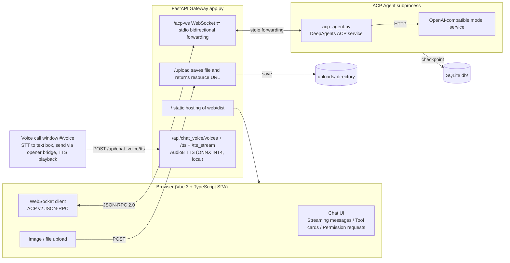

# DeepAgents + ACP + FastAPI Gateway

This project is a runnable ACP (Agent Client Protocol) web integration example: a Vue 3 chat client talks to a DeepAgents agent through a FastAPI gateway over WebSocket, and the agent calls an OpenAI-compatible model service to complete tasks step by step with tool calls.

## Overview

- **Streaming chat**: AI replies stream in real time — text, thought, execution plan and tool-call cards are rendered incrementally; Markdown, code highlight, Mermaid diagrams and sanitized inline HTML are all supported.
- **Tool calls**: each tool card shows parameters / return value in collapsible `json` tabs; permission requests (`session/request_permission`) can be approved, rejected or always-approved.
- **Message actions**: copy (plain text or Markdown), retry (last AI message only), edit (Markdown source editing without re-running), delete via the `...` menu.
- **Conversations**: recent-conversation sidebar with search/filter, rename via context menu, delete with confirmation, and timestamps in `YYYY/MM/DD hh:mm:ss`.
- **Attachments**: upload or paste images/files, inline preview, download on click; context usage (used / `CONTENT_SIZE`) shown as percentage with hover detail.
- **Error handling**: ACP error details are returned to the frontend, displayed as the AI message content plus a red error block; the stop button always recovers to send after failures or disconnects.
- **Multi-language**: UI supports Simplified Chinese / Japanese / English (i18n locale files under `web/src/locales/`).
- **Voice call** (2.0): a top-bar call icon opens a dedicated voice-call window (`#/voice`, dark theme) that stays separate from the chat UI. It captures your speech with the browser Web Speech API (STT), synchronizes the recognized text into the main window's input box, and auto-sends it on pause through a `window.opener` bridge (`chatBridge`) so it runs as a normal session message; when the AI reply finishes, the call window fetches local TTS (`/api/chat_voice/tts`, Audio8 TTS ONNX INT4 in `models/`, in-memory WAV) and speaks it aloud, then resumes listening. The main window keeps a reply-speak toggle next to the call icon, and message action bars have a speak button for any plain-text message.
- **Local run**: `start.ps1` / `stop.ps1` manage the gateway and agent processes; all runtime knobs are configured via `.env`.

## Architecture



- **ACP layer**: Uses `deepagents-acp` and `agent-client-protocol` to automatically handle protocol messages such as `session/update` and `session/request_permission`, without requiring manual JSON-RPC handling.
- **Gateway layer**: `app.py` handles bidirectional `WebSocket ⇄ stdio` forwarding and file uploads, without parsing business logic.
- **Frontend**: `web/` is a Vue 3 + TypeScript SPA (Vite build, Naive UI) that implements the ACP v2 client; its build output (`web/dist`) is served by the gateway at the root path `/`. `static/index.html` is kept only as a legacy demo page.

## Project structure

```text
./
├─ app.py                # FastAPI gateway (/upload + /acp-ws, serves web/dist at /)
├─ api/
│  └─ chat_voice/        # Voice synthesis sub-router (/api/chat_voice/voices + /tts)
├─ acp_agent.py          # DeepAgents ACP agent (stdio service)
├─ utils/
│  └─ model_util.py     # Model initialization configuration (OpenAI-compatible API)
├─ web/                  # Vue 3 + TypeScript ACP client (Vite build → web/dist)
│  ├─ src/              # pages: ChatPage / VoiceCallPage; components: ExecutionProcess / ToolCallCard / MarkdownMessage
│  └─ dist/             # build output, served by app.py at the root path
├─ static/
│  └─ index.html        # Legacy demo page (no longer the active frontend)
├─ docs/                # Design documents (DESIGN_ZH.md, UI_DESIGN.md)
├─ uploads/              # Uploaded file storage directory (created automatically)
├─ db/                   # SQLite checkpoint directory (created automatically)
├─ .env                  # Application configuration (HOST/PORT/model endpoint)
├─ requirements.txt
├─ LICENSE
├─ README.md
├─ README_ZH.md
├─ README_JA.md
└─ .venv/                # Optional local virtual environment
```

## Current implementation details

The actual entry point of this project is `app.py`, not the old `gateway.py` shown in earlier documentation:

- `app.py` starts the FastAPI service.
- `@app.post("/upload")` accepts uploaded files, saves them under `uploads/`, and returns:
  - `uri`: accessible HTTP URL
  - `name`: filename
  - `mimeType`: MIME type
- `@app.websocket("/acp-ws")` creates an independent `acp_agent.py` subprocess for each WebSocket connection and forwards traffic in both directions.
- `acp_agent.py` uses `create_deep_agent(...)` and `interrupt_on` to trigger permission approval.

## Quick start

### 1) Create a virtual environment and install dependencies

```powershell
python -m venv .venv
.\.venv\Scripts\pip install -r requirements.txt
```

### 2) Configure environment variables

A `.env` file is included in the project. Example configuration:

```env
# [Common Settings]
PYTHONIOENCODING=utf-8
APP_ENV=pro

MODEL_PROVIDER=openai

TAVILY_API_KEY=-
TIMEOUT=300
MAX_RETRY=2

# [AI settings]
API_KEY=-
ENDPOINT=http://192.168.3.28:8088
MODEL_NAME=qwen3.8-9b
TEMPERATURE=0.8
TOP_P=
MAX_TOKENS=10240
```

Notes:
- `ENDPOINT` is the OpenAI-compatible API base URL.
- `API_KEY` is the access key for the model service.
- `APP_HOST` / `APP_PORT` control FastAPI listening settings.
- `CONTENT_SIZE` is the context window size (tokens), used by the frontend to show the context usage percentage (served via `/api/config`).
- `UPLOAD_ROOT` is the upload storage root (relative to project root or absolute, defaults to `uploads/`); this directory is ignored by git.

If you are connecting directly to the official OpenAI API, configure those values in the same way according to your environment.

### 3) Start the gateway

```powershell
.\.venv\Scripts\python app.py
```

Default listening address:
- `http://127.0.0.1:8000`

### 4) Open the frontend page

```text
http://127.0.0.1:8000/
```

The root path serves the built Vue SPA (`web/dist`).

## Frontend interaction flow

### File upload

After selecting an image or file, the frontend sends:

```http
POST /upload
Content-Type: multipart/form-data
```

A typical response is:

```json
{
  "uri": "http://127.0.0.1:8000/uploads/xxx.png",
  "name": "xxx.png",
  "mimeType": "image/png"
}
```

The frontend then adds this resource to the `session/prompt` content list: plain files as a virtual-path text context (e.g. `/uploads/xxx.png`), images as ACP `image` content blocks.

### ACP session flow

The frontend executes the following sequence:

1. `initialize` — establish the ACP connection and negotiate protocol version
2. `session/new` — create a new session on first submission
3. `session/prompt` — send the user's task and optional resources
4. `session/update` — receive ongoing agent status updates
5. `session/request_permission` — show an approval dialog when the agent needs user confirmation

## Session reuse behavior

The frontend supports multi-turn conversation reuse and history restoration:

- First submission: creates a new session automatically
- Subsequent submissions: reuse the current `sessionId` and the agent retains prior memory
- Clicking "New Session": starts a fresh session and discards old memory
- Refreshing the page or reconnecting the WebSocket: the UI restores conversations from `localStorage` and calls `session/load` to replay the agent history from the SQLite checkpoint

Core principle:
- Each WebSocket connection starts a dedicated `acp_agent.py` subprocess
- `AgentServerACP` persists LangGraph checkpoints to `db/agent_state.sqlite` by `sessionId` (`load_sessions=True`)
- Repeated `session/prompt` calls on the same connection enable multi-turn interaction; `session/load` restores history across reconnects

## Permission approval mechanism

`acp_agent.py` enables `interrupt_on`, so before risky operations the system triggers an HITL interruption and converts it into ACP `session/request_permission`:

```python
interrupt_on={
    "execute": False,     # shell commands run without approval (always allowed by command type)
    "delete": True,       # delete operations require user approval
}
```

The frontend shows a permission dialog with options:
- Allow
- Reject
- Always allow

Reply payload:

```json
{ "outcome": { "outcome": "selected", "optionId": "approve" } }
```

> The frontend replies using the same message ID to ensure ACP request/response matching.

## Model and tool configuration

Model initialization is done in [utils/model_util.py](utils/model_util.py):

```python
MODEL = init_chat_model(
    MODEL_NAME,
    model_provider=MODEL_PROVIDER,
    base_url=ENDPOINT,
    api_key=API_KEY,
    timeout=TIMEOUT,
    max_retries=MAX_RETRY,
    temperature=TEMPERATURE,
    max_tokens=MAX_TOKENS,
)
```

This means the project currently uses an OpenAI-compatible service, and both the model name and endpoint can be adjusted in `.env`.

## Typical usage examples

### Task: analyze an image and generate a config

1. Enter a task in the frontend, for example:
   - “Analyze the uploaded image and generate a project configuration.”
2. Select an image file.
3. Click “Submit Task”.
4. The agent will output:
   - execution plan
   - streaming text
   - tool call cards
   - final summary

### Task: execute a shell command

If the agent needs to run a shell command, the system will show a permission dialog so the user can allow or reject it.

## Troubleshooting

### 1. The page does nothing when clicking “Submit Task”

Check:
- Whether the backend is running: `http://127.0.0.1:8000/docs`
- Whether the page was refreshed with Ctrl + F5
- Whether the frontend JS log shows errors

### 2. The model returns “Missing credentials” / “Connection error”

This usually means:
- `.env` has an invalid `API_KEY` or `ENDPOINT`
- The model service is not running or the address is unreachable
- The OpenAI-compatible service rejects the request

### 3. Port is already in use

Modify `.env`:

```env
APP_PORT=8000
```

Or stop the process using that port before starting the server.

## Known limitations

- Each WebSocket connection starts an independent agent subprocess, which is suitable for demo or single-user scenarios.
- Uploaded files currently have no quota or cleanup policy.
- There is no authentication layer; production deployments should add token validation.
- The current example is demo-oriented and can be extended into a multi-session or multi-tenant architecture.

## Summary

The current implementation focuses on:

- `app.py` as the FastAPI gateway
- `acp_agent.py` as the ACP runtime
- `web/` as the Vue 3 SPA web UI (build output `web/dist` served by the gateway)
- `.env` and [utils/model_util.py](utils/model_util.py) as model configuration entry points

For developers, this project is both a practical ACP integration example and a solid template for web-to-agent bridging.
