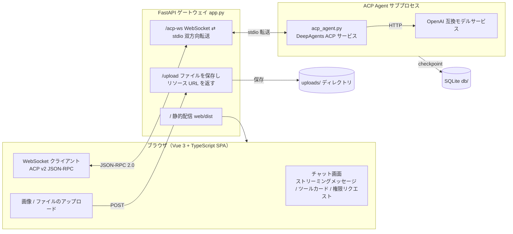

# DeepAgents + ACP + FastAPI Gateway

このプロジェクトは、実行可能な ACP（Agent Client Protocol）Web 統合サンプルです。Vue 3 チャットクライアントが FastAPI ゲートウェイ経由で WebSocket により DeepAgents Agent と通信し、Agent は OpenAI 互換モデルサービスを呼び出してツール呼び出し付きのタスクを段階的に完了します。

## 機能概要

- **ストリーミングチャット**: AI の応答がリアルタイムでストリーミング表示されます（テキスト・思考・実行プラン・ツール呼び出しカードを段階的にレンダリング）。Markdown、コードハイライト、Mermaid 図、サニタイズ済みインライン HTML に対応。
- **ツール呼び出し**: 各ツールカードはパラメーター / 戻り値を折りたたみ式 `json` タブで表示。権限リクエスト（`session/request_permission`）は許可・拒否・常に許可のいずれかで対応。
- **メッセージ操作**: コピー（プレーンテキスト / Markdown）、リトライ（最後の AI メッセージのみ）、編集（Markdown ソースを編集し再実行しない）、`...` メニューから削除。
- **会話管理**: 最近の会話サイドバーで検索・フィルター、右クリックで名前変更、確認付き削除。時刻は `YYYY/MM/DD hh:mm:ss` 形式。
- **添付ファイル**: 画像 / ファイルのアップロードまたは貼り付け、インラインプレビュー、クリックでダウンロード。コンテキスト使用量（使用 / `CONTENT_SIZE`）をパーセント表示し、ホバーで詳細を確認。
- **エラー処理**: ACP のエラー詳細をフロントエンドに返し、AI メッセージとして表示（赤いエラーブロックも維持）。エラーや接続切断後も停止ボタンは必ず送信に戻ります。
- **多言語**: UI は簡体字中国語 / 日本語 / 英語に対応（言語ファイルは `web/src/locales/`）。
- **ローカル実行**: `start.ps1` / `stop.ps1` でゲートウェイと Agent プロセスを管理。実行時設定はすべて `.env` で構成。

## アーキテクチャ図



- **ACP 層**: `deepagents-acp` と `agent-client-protocol` を利用し、`session/update` や `session/request_permission` などのプロトコルメッセージを自動処理します。手動で JSON-RPC を書く必要はありません。
- **ゲートウェイ層**: `app.py` は `WebSocket ⇄ stdio` の双方向転送とファイルアップロードを担当し、ビジネスロジックそのものは解析しません。
- **フロントエンド**: `web/` は Vue 3 + TypeScript の SPA（Vite ビルド、Naive UI）で、ACP v2 クライアントを実装しています。ビルド成果物 `web/dist` はゲートウェイがルートパス `/` で配信します。`static/index.html` は旧デモページとしてのみ残されています。

## ディレクトリ構成

```text
./
├─ app.py                # FastAPI ゲートウェイ（/upload + /acp-ws、ルートパスで web/dist を配信）
├─ acp_agent.py          # DeepAgents ACP agent（stdio サービス）
├─ utils/
│  └─ model_util.py     # モデル初期化設定（OpenAI 互換 API）
├─ web/                  # Vue 3 + TypeScript ACP クライアント（Vite ビルド → web/dist）
│  ├─ src/              # コンポーネント: ChatPage / ExecutionProcess / ToolCallCard / MarkdownMessage
│  └─ dist/             # ビルド成果物（app.py がルートパスで配信）
├─ static/
│  └─ index.html        # 旧デモページ（アクティブなフロントエンドではない）
├─ docs/                # 設計ドキュメント（DESIGN_ZH.md、UI_DESIGN.md）
├─ uploads/              # アップロードファイル保存先（自動作成）
├─ db/                   # SQLite checkpoint ディレクトリ（自動作成）
├─ .env                  # アプリ設定（HOST/PORT / モデル API）
├─ requirements.txt
├─ LICENSE
├─ README.md
├─ README_ZH.md
├─ README_JA.md
└─ .venv/                # 任意のローカル仮想環境
```

## 現在の実装内容

このプロジェクトの実際のエントリーポイントは旧版 README にあった `gateway.py` ではなく、`app.py` です。

- `app.py` が FastAPI サービスを起動します。
- `@app.post("/upload")` がファイルを受け取り、`uploads/` に保存したうえで次を返します。
  - `uri`: アクセス可能な HTTP URL
  - `name`: ファイル名
  - `mimeType`: MIME タイプ
- `@app.websocket("/acp-ws")` は各 WebSocket 接続ごとに独立した `acp_agent.py` サブプロセスを作成し、双方向に転送します。
- `acp_agent.py` の `build_agent()` は `create_deep_agent(...)` と `interrupt_on` を使って権限確認を発火します。

## 起動手順

### 1) 仮想環境を作成し依存関係をインストール

```powershell
python -m venv .venv
.\.venv\Scripts\pip install -r requirements.txt
```

### 2) 環境変数を設定

プロジェクトには `.env` が含まれており、例は次の通りです。

```env
# [Common Settings]
PYTHONIOENCODING=utf-8
APP_ENV=pro

MODEL_PROVIDER=openai

TAVILY_API_KEY=-
TIMEOUT=300
MAX_RETRY=2

# [AI settings]
API_KEY=-
ENDPOINT=http://192.168.3.28:8088
MODEL_NAME=qwen3.8-9b
TEMPERATURE=0.8
TOP_P=
MAX_TOKENS=10240
```

補足:
- `ENDPOINT` は OpenAI 互換 API のベース URL です。
- `API_KEY` はモデルサービスのアクセスキーです。
- `APP_HOST` / `APP_PORT` で FastAPI の待ち受け設定を制御します。

OpenAI 公式 API に直接接続する場合でも、同じ考え方で環境変数を設定してください。

### 3) ゲートウェイを起動

```powershell
.\.venv\Scripts\python app.py
```

デフォルトの待ち受け先:
- `http://127.0.0.1:8000`

### 4) フロントエンドページを開く

```text
http://127.0.0.1:8000/
```

ルートパスはビルド済みの Vue SPA（`web/dist`）を配信します。

## フロントエンドの対話フロー

### ファイルアップロード

フロントエンド側で画像またはファイルを選択すると、次のようにアップロードを実行します。

```http
POST /upload
Content-Type: multipart/form-data
```

返却例:

```json
{
  "uri": "http://127.0.0.1:8000/uploads/xxx.png",
  "name": "xxx.png",
  "mimeType": "image/png"
}
```

その後、フロントエンドはこのリソースを `session/prompt` のコンテンツ一覧に追加します。通常ファイルは仮想パスのテキストコンテキスト（例: `/uploads/xxx.png`）、画像は ACP の `image` コンテンツブロックとして扱います。

### ACP セッションの流れ

フロントエンドは次の順序で処理を行います。

1. `initialize` — ACP 接続を確立しプロトコルバージョンを交渉する
2. `session/new` — 初回送信時に新規セッションを作成する
3. `session/prompt` — ユーザーのタスクと必要に応じたリソースを送信する
4. `session/update` — エージェントの進捗状態を受信し続ける
5. `session/request_permission` — エージェントがユーザー確認を必要としたときに承認ダイアログを表示する

## セッション再利用

フロントエンドにはマルチターン対話の再利用と履歴復元機能があります。

- 初回送信: 自動的に新しいセッションを作成
- 以降の送信: 現在の `sessionId` を再利用し、エージェントが過去の記憶を保持
- 「新規セッション」クリック: セッションをリセットし、古い記憶を破棄
- ページ更新や WebSocket 切断: UI は `localStorage` から会話を復元し、`session/load` で SQLite checkpoint からエージェント履歴をリプレイ

基本原理:
- 各 WebSocket 接続ごとに `acp_agent.py` のサブプロセスが起動する
- `AgentServerACP` は `load_sessions=True` で、`sessionId` ごとに LangGraph checkpoint を `db/agent_state.sqlite` へ永続化する
- 同一接続で `session/prompt` を複数回呼ぶことでマルチターン対話が可能になり、再接続時は `session/load` で履歴を復元する

## 権限承認メカニズム

`acp_agent.py` では `interrupt_on` を有効化しており、高リスク操作の前に HITL 割り込みを発生させ、その後 ACP の `session/request_permission` に変換します。

```python
interrupt_on={
    "execute": False,     # shell コマンドは既定で許可（コマンド種別で常に許可）
    "delete": True,       # 削除操作はユーザー承認が必要
}
```

フロントエンドは次の選択肢を持つ確認ダイアログを表示します。
- 許可
- 拒否
- 常に許可

返信例:

```json
{ "outcome": { "outcome": "selected", "optionId": "approve" } }
```

> フロントエンドは同じメッセージ ID で応答し、ACP のリクエスト/レスポンスの対応を保ちます。

## モデルとツール設定

モデル初期化は [utils/model_util.py](utils/model_util.py) にあります。

```python
MODEL = init_chat_model(
    MODEL_NAME,
    model_provider=MODEL_PROVIDER,
    base_url=ENDPOINT,
    api_key=API_KEY,
    timeout=TIMEOUT,
    max_retries=MAX_RETRY,
    temperature=TEMPERATURE,
    max_tokens=MAX_TOKENS,
)
```

つまり、このプロジェクトは OpenAI 互換サービスを利用しており、モデル名やエンドポイントは `.env` で簡単に調整できます。

## 代表的な利用例

### タスク: 画像を分析して設定を生成する

1. フロントエンドにタスクを入力する
   - 例: 「アップロードされた画像を分析し、プロジェクト設定を作成して」
2. 画像ファイルを選択する
3. 「Submit Task」をクリックする
4. エージェントは次を出力する
   - 実行計画
   - ストリーミングテキスト
   - ツール呼び出しカード
   - 最終まとめ

### タスク: シェルコマンドを実行する

エージェントがシェルコマンドを実行する必要がある場合、権限承認ダイアログが表示され、ユーザーが許可または拒否を選択します。

## よくある問題と対処法

### 1. 「Submit Task」を押しても反応がない

確認事項:
- バックエンドが起動しているか: `http://127.0.0.1:8000/docs` にアクセス可能か
- ページを Ctrl + F5 で再読込したか
- フロントエンドの JS ログにエラーが出ていないか

### 2. モデルが “Missing credentials” / “Connection error” を返す

一般的には次が原因です。
- `.env` の `API_KEY` または `ENDPOINT` が不正
- モデルサービスが起動していない、またはアドレスに到達できない
- OpenAI 互換サービスがリクエストを拒否している

### 3. ポートが既に使用されている

`.env` で次を変更してください。

```env
APP_PORT=8000
```

または、起動前にそのポートを使っているプロセスを停止してください。

## 既知の制約

- 各 WebSocket 接続ごとに独立したエージェントサブプロセスを起動するため、デモや単一ユーザー向けの利用に適している
- アップロードファイルに対する割り当て量や自動削除の仕組みはまだない
- 認証機構がなく、本番環境ではトークン検証を追加することを推奨する
- 現時点の例はデモ中心で、多セッションやマルチテナント構成へ拡張可能

## まとめ

今回の実装の中心は次の通りです。

- `app.py` が FastAPI ゲートウェイとして動作する
- `acp_agent.py` が ACP ランタイムとして動作する
- `web/` が Vue 3 SPA のインターフェースを提供する（ビルド成果物 `web/dist` はゲートウェイが配信）
- `.env` と [utils/model_util.py](utils/model_util.py) がモデル接続設定を担う

開発者にとって、このプロジェクトは ACP 連携の実例としても、Web とエージェントの橋渡しテンプレートとしても役立ちます。
