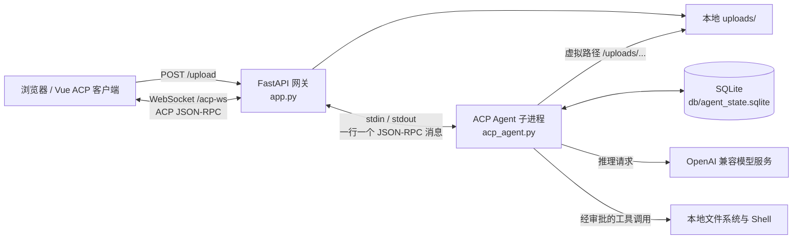
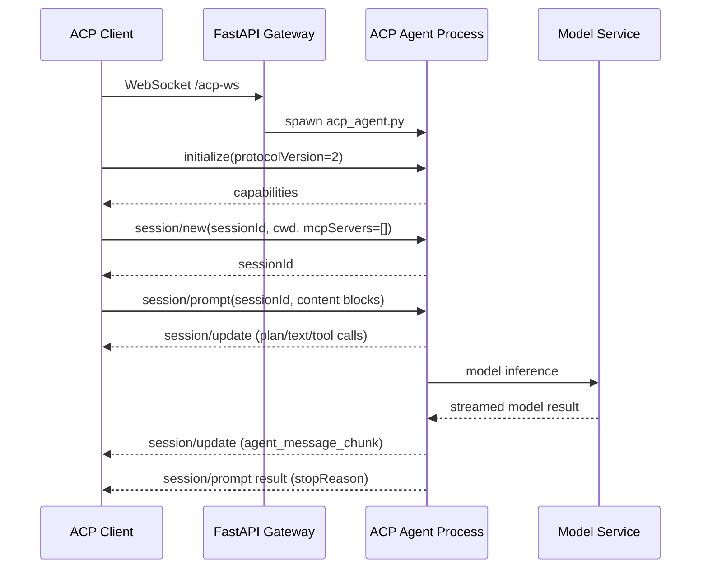
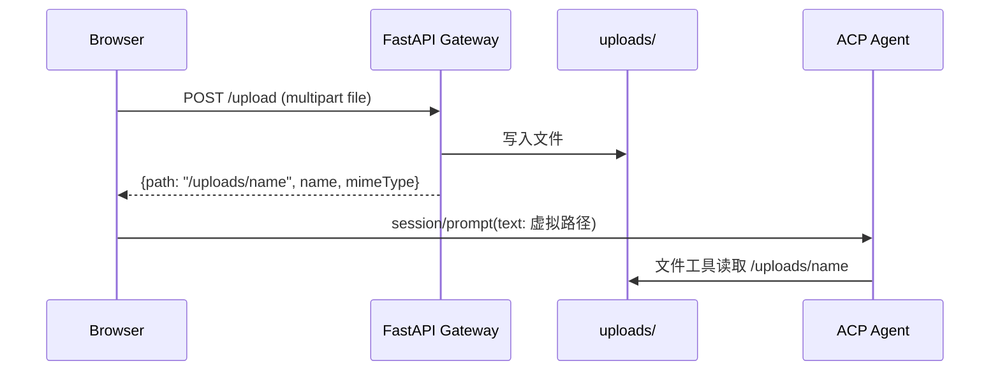
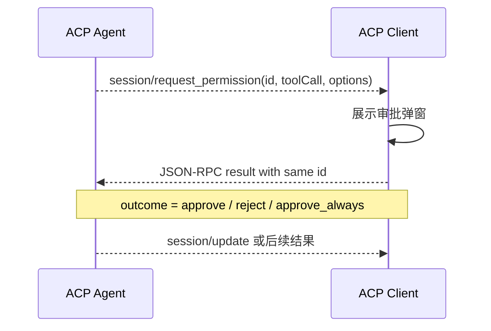

# DeepAgents ACP Demo MVP 系统设计说明书

| 项目 | 内容 |
| --- | --- |
| 系统名称 | DeepAgents ACP Demo MVP |
| 文档名称 | 系统设计说明书 |
| 文档版本 | V1.2 |
| 适用范围 | FastAPI 网关、ACP Agent、模型接入与 Vue Web 客户端 |
| 不包含范围 | 模型服务的部署与鉴权实现 |

## 1. 概述

### 1.1 建设目标

系统提供浏览器 ACP 客户端到 DeepAgents Agent 的端到端接入能力。客户端通过 ACP v2 / JSON-RPC 建立会话、提交任务、接收流式更新并处理审批请求；网关负责网络连接、文件资源和进程桥接；Agent 负责调用模型、执行工具、维护会话状态。

### 1.2 设计范围

| 模块 | 设计职责 |
| --- | --- |
| `app.py` | 提供上传接口、静态资源服务及 WebSocket 到 stdio 的双向桥接。 |
| `acp_agent.py` | 启动 ACP Agent 服务，装配 DeepAgents、工具后端和 SQLite checkpoint。 |
| `utils/model_util.py` | 读取环境配置并初始化 OpenAI 兼容模型。 |
| `api/chat_voice/` | 语音通话子路由（挂载于 `app.py`）：音色列表 + Kokoro TTS 合成（ONNX fp16 本地推理，24kHz），不封装 LLM 对话。 |
| `web/` | Vue 3 / TypeScript ACP 客户端，构建产物由网关托管。 |

## 2. 总体设计

系统以 FastAPI 网关作为网络边界。网关不解释 ACP 业务消息，仅负责将 WebSocket 文本消息与 Agent 子进程的标准输入/输出逐行双向转发。每个 WebSocket 连接对应一个独立的 `acp_agent.py` 子进程。

## 3. 详细设计

### 4.1 FastAPI 网关：`app.py`

网关提供以下端点和职责：

| 路径 | 协议 | 职责 |
| --- | --- | --- |
| `/upload` | HTTP `POST` | 接收非图片 multipart 文件，使用文件名基名写入 `UPLOAD_ROOT` 指定目录（默认 `uploads/`），返回虚拟路径、名称和 MIME 类型。 |
| `/acp-ws` | WebSocket | 创建 Agent 子进程，并在 WebSocket 与 stdio 之间透传 ACP JSON-RPC。 |
| `/uploads` | HTTP 静态资源 | 供浏览器下载或预览已上传文件。 |
| `/` | HTTP 静态资源 | 托管 `web/dist` 构建产物与 SPA 回退入口。 |

每个 Agent 子进程以项目根目录为工作目录启动。子进程 stdout/stderr 流上限为 `16 MiB`，用于承载 Base64 图片造成的较长 ACP JSON-RPC 行；stderr 写入网关运行日志而不混入 ACP stdout。连接关闭或任一转发方向结束时，网关会取消另一侧转发任务，并终止 Agent 进程。在 Windows 上使用 `taskkill /T /F` 清理进程树，避免 Python 启动器遗留子进程。

### 4.2 ACP Agent：`acp_agent.py`

Agent 通过 `run_agent` 以 stdio ACP 服务模式运行，协议编解码、会话更新事件和中断到 ACP 权限请求的转换由 `deepagents-acp` 完成。

`AgentServerACP` 使用以下配置：

- `load_sessions=True`：向客户端声明会话加载能力，并支持 `session/load`。
- 共享 `AsyncSqliteSaver`：将各会话的 LangGraph checkpoint 写入 `db/agent_state.sqlite`。
- Agent 工厂：每个会话上下文调用 `build_agent(context, checkpointer)` 创建 DeepAgent。

`build_agent` 选择 `CompositeBackend`：

- 默认后端为 `PowerShellBackend`（Windows）/ `LocalShellBackend`（其他平台），根目录取 ACP 会话的 `cwd`，并以 `virtual_mode=True`、`inherit_env=True` 运行。文件工具中的 `/uploads/example.txt` 映射到项目根下的 `uploads/example.txt`；Shell 仍以根目录为工作目录执行。
- `/memories/` 和 `/conversation_history/` 路由到内存态 `StateBackend`，不写入本地文件系统。
- 当前未注入 MCP 工具，`tools=None`。
- `delete` 配置到 `interrupt_on`，删除前必须由客户端对权限请求作答；`execute` 为 `False`（shell 命令按命令类型默认放行），`write_file`/`edit_file` 未启用审批。
- 图片作为 ACP `image` 内容块直接传给模型，Agent 应直接分析，不调用文件读取工具；其他附件使用 `/uploads/...` 虚拟路径并由文件工具读取。

### 4.3 模型初始化：`utils/model_util.py`

模块在导入时加载 `.env`，再通过 LangChain `init_chat_model` 创建全局 `MODEL`。模型服务需兼容 OpenAI 风格接口，支持通过以下环境变量配置：

| 变量 | 含义 | 代码默认值 |
| --- | --- | --- |
| `ENDPOINT` | 模型服务基础地址 | `http://192.168.3.28:8088` |
| `API_KEY` | 模型服务凭据 | 未设置 |
| `MODEL_PROVIDER` | LangChain 模型提供方 | `openai` |
| `MODEL_NAME` | 模型名称 | `qwen3.8-9b` |
| `TEMPERATURE` | 温度参数 | `0.5` |
| `TOP_P` | 核采样参数（默认不传，配置后按变量值传入；部分模型不支持该参数时留空可避免 400 报错） | 未设置（None） |
| `MAX_TOKENS` | 最大生成 token 数 | `65535` |
| `MAX_RETRY` | 最大重试次数 | `3` |
| `TIMEOUT` | 单次请求超时 | 未设置 |
| `DB_ROOT` | SQLite 状态文件目录 | `./db` |
| `APP_HOST` | 网关监听地址 | `0.0.0.0` |
| `APP_PORT` | 网关监听端口 | `8000` |
| `CONTENT_SIZE` | 上下文窗口大小（tokens），用于前端上下文用量百分比显示（经 `/api/config` 下发） | 未设置（前端不显示用量）；`.env` 示例 `32768` |
| `UPLOAD_ROOT` | 文件上传存储根目录（相对项目根或绝对路径） | `uploads` |

### 4.4 Vue 客户端：`web/`

Vue 客户端直接实现 ACP v2 JSON-RPC：

- 使用递增请求 ID 和 `pending` 表匹配调用结果。
- 优先分派带 `method` 的服务端请求，避免服务端权限请求 ID 与客户端请求 ID 重合时误判。
- 渲染 `session/update` 中的文本分片、思考分片、计划和工具调用信息，并按事件到达顺序交错呈现：分析文本段 → 执行计划面板 → 独立工具调用卡片 → 最终文本段。
- 处理 `session/request_permission`，以相同 JSON-RPC ID 返回 `approve`、`reject` 或 `approve_always`。
- 在浏览器 `localStorage` 中保存会话、消息、附件预览、执行过程与工具卡片的展示状态（`segments` 分段结构）；实际 Agent 上下文仍以 SQLite checkpoint 为准。
- 会话栏提供标题关键字搜索过滤、删除二次确认（`NPopconfirm`）；时间统一显示为 `YYYY/MM/DD hh:mm:ss`；文本、Markdown 与代码块复制成功后均显示“已复制”提示。
- AI 流式输出期间内容更新后自动滚动到底部，跟随最新输出，且流式跟随滚动采用瞬时定位（跳过 smooth 动画，避免滚动动画与内容增量叠加造成视觉抖动；用户手动滚动不受影响）；流式期间用户鼠标滚轮/触摸滚动会暂停自动跟随，2 秒无操作或点击“滚动到底部”按钮后恢复；对话区右下角提供“滚动到底部”按钮，以绝对定位固定于滚动视口右下角（不随内容滚动），仅在滚动条未到达底部时显示，点击平滑滚动到底后自动隐藏；Mermaid 图流式期间代码块就绪即异步渲染，并按源码缓存结果复用（mermaidCache），模块预加载并仅初始化一次；Markdown 渲染开启 html 元素预览（`html:true`），渲染结果经 DOMPurify 白名单消毒（移除脚本与事件属性）防 XSS，链接自动新窗口打开；消息工具栏提供“更多操作”下拉（含删除该消息）；用户与 AI 历史消息均可编辑（编辑按钮位于“更多操作”之前），以 Markdown 文本编辑并实时预览，保存后同步消息文本（AI 消息同步 `finalText` 与文本分段），仅编辑文本不触发重新执行，流式执行中的消息禁用编辑。
- 输入框支持剪贴板图片直接粘贴（截图无需保存为文件）成为图片附件；输入卡片采用大圆角样式，底部功能栏包含附件、技能、工具按钮（点击技能/工具打开右侧功能面板）与上下文用量显示（发送按钮左侧：已使用/CONTENT_SIZE 百分比，悬停显示具体 `使用量/CONTENT_SIZE`，总量由 `.env` 的 `CONTENT_SIZE` 配置并经 `/api/config` 下发）。
- 消息中发送的附件 chip 可点击：图片附件在新窗口打开预览，普通文件附件触发浏览器下载（保留原文件名）。
- 新建会话复用现有空会话，始终至多保留一个空会话；会话列表项支持右键重命名（弹出与消息菜单风格一致的重命名菜单，模态框内编辑并保存）。
- 整体为三列布局：左侧会话栏可在品牌行通过收缩按钮收起（顶部栏出现展开按钮）；右侧功能面板是聊天窗口内嵌的静态右栏（300px，非浮层抽屉），默认隐藏、不占空间，无标签页，点击输入区“技能”或“工具”按钮显示，面板标题与内容根据触发功能确定（技能/工具/设置面板），右上角带关闭图标，打开时挤压中间对话区，内容区当前为占位说明。
- 界面字体随语言切换（中/日/英各自字体栈），naive-ui 组件与页面正文同步生效。
- 页面加载后以后端 checkpoint 为准校验历史会话（`session/load`），失效会话（如 `db` 被删除）自动清理并新建空会话。
- 图片在浏览器中转为 Base64，作为 ACP `image` 块发送；普通文件上传后以 `/uploads/...` 文本上下文发送。

### 4.5 语音通话：独立窗口 `#/voice` + 桥接主会话（2.0）

语音通话保留独立通话窗口（顶部图标 `window.open` 打开 `#/voice`，脱离聊天界面），但不单独封装 LLM 对话接口——只提供纯 TTS 合成，对话复用主聊天流程：

- 后端 `api/chat_voice/chat_voice.py` 以 `APIRouter(prefix="/api/chat_voice")` 挂载到 `app.py`（`include_router`），提供：
  - `GET /api/chat_voice/voices`：返回全部已下载音色（v1.0 英文 `af_*`/`am_*`/`bf_*`/`bm_*` + v1.1-zh 中文 `zf_*`/`zm_*`，24000Hz）。
  - `GET /api/chat_voice/config`：返回播报模式配置 `{mode, chunk_frames, sample_rate}`（mode 由 `TTS_MODE` 决定：`stream` / `file`，sample_rate 恒为 24000），前端据此选择播放路径。
  - `POST /api/chat_voice/tts`：请求 `{text, voice}`，调 `tts_api.synthesize_wav_bytes()` 用 Kokoro-82M（ONNX Runtime 纯 CPU，fp16 82M）在内存中合成 WAV，返回 `{text, audio(base64)}`；不落盘、不调用 LLM。长文本按句子自动分段（`tts_api.split_text`），各段 PCM 无缝拼接后一次编码 WAV，不受 510 token 上下文截断。
  - `POST /api/chat_voice/tts_stream`：请求同 `/tts`，长文本同样按句分段，每段合成后经 `iter_pcm_chunks()` 逐段返回 16-bit PCM 字节流（单声道 24kHz LE），前端 Web Audio 排队播放，首包延迟低于整体合成；`TTS_STREAM_CHUNK_FRAMES` 保留仅为兼容（Kokoro 为句子级流式，每段整段产出）。
- 本地推理模块 `api/chat_voice/tts_api.py`：链路为 文本 → espeak-ng 音素化（`espeakng_runtime` 直接加载 `third_party/espeak-ng/libespeak_ng.dll` + `espeak-ng-data`）→ `kokorog2p.phonemes_to_ids` 映射（按语言选词表）→ ONNX 推理 → 24kHz 音频。**双模型**：zh 文本 → `models/Kokoro-82M-v1.1-zh-ONNX`（中文音色 `zf_*`/`zm_*`，词表 `model='1.1-zh'`）；en/ja 文本 → `models/Kokoro-82M-v1.0-ONNX`（英文音色 `af_*`/`am_*`/`bf_*`/`bm_*`，词表 `model='1.0'`）；模型目录可用 `KOKORO_MODEL_DIR_ZH`/`KOKORO_MODEL_DIR_EN` 环境变量覆盖。`get_espeak()` 与 `get_session(lang)` 按语言惰性缓存，`split_text()` 按句子边界切分（单段 ~120 字，过短段合并），`synthesize_wav_bytes()` 分段合成并拼接输出内存 WAV 字节（24kHz）。原 Audio8 实现备份于 `tts_api.audio8.bak.py`，v1.0 单模型实现备份于 `tts_api.kokoro_v1_0.bak.py`。
- 独立窗口 `web/src/pages/VoiceCallPage.vue`（深色通话主题）：
  - 麦克风按钮切换浏览器 Web Speech API（`webkitSpeechRecognition`，continuous + interim，语言随 `localStorage.chat_primary_language` 的 zh/en/ja）——识别文字实时同步到主窗口输入框（`chatBridge.updateInput`）。
  - 识别停顿约 0.9s 自动发送（`chatBridge.sendMessage(text)`，无需手动点击），主窗口写入输入框并触发正常 ACP 会话（`submitPrompt`）；停止识别时未发送文本也会补发。
  - AI 回复完成后主窗口 `speakReplyIfEnabled(text)` 优先触发已注册的回调（通知独立窗口），否则按"回复朗读"开关在主窗口朗读；独立窗口收到回复后调用 `/tts` 合成并播放，播完自动恢复聆听。
  - 顶部：通话状态点（未连接/通话中）、音色下拉（数据来自 `/voices`，持久化 `localStorage.chat_voice_name`）、挂断、关闭；无 `opener` 时显示"请从主界面语音通话入口打开"提示。
- 主窗口 `ChatPage.vue`：顶部通话图标（`CallOutline`）旁为"回复朗读"开关（默认关闭），再右侧为"共享屏幕"按钮（开启后高亮，发送消息时自动截屏作为图片附件，见 4.6）；消息操作栏保留"朗读"按钮（对任意纯文本消息调 `/tts`，再点停止）。
- 播报模式环境变量：`TTS_MODE=file`（默认，非流式——等完整 WAV 后播放，全量合成最快）或 `stream`（流式优先，首包低延迟）；`TTS_STREAM_CHUNK_FRAMES=48`（流式每块音频帧数，CPU 机器建议 48+）。前端播报前先 `GET /api/chat_voice/config` 读取模式，`file` 直接走 `/tts`，`stream` 流式优先、失败回退 `/tts`。`.env` 与 `.env.bak` 已同步。
- 依赖：`requirements.txt` 移除 `edge-tts`；Kokoro 运行依赖为 `espeakng-runtime`（espeak-ng DLL 绑定）、`kokorog2p`（音素→token 映射）、`numpy/onnxruntime/soundfile`（推理与编码）；`vite.config.ts` 开发代理增加 `/api`；`web/src/router/index.js` 增加 `/voice` 路由。
- 说明：STT 依赖浏览器语音识别服务（需麦克风授权）；TTS 为本地 CPU 推理（长文本分段合成，单段 ~120 字、Kokoro token 上下文 510（v1.0）/ 词表更大（v1.1-zh），段间无缝拼接，不再有 ≤150 字限制）；**音色解析**：请求 voice 缺失 / 未知（含旧 Audio8 名 zh/en）时，按文本语言（含假名→ja、含汉字→zh、否则 en）自动选择 `TTS_VOICE_ZH` / `TTS_VOICE_JA` / `TTS_VOICE_EN` 配置的默认音色（zh 默认 `zf_001`，v1.1-zh 中文音色编号 `zf_001~zf_055`/`zm_001~zm_045`，建议多试听几个编号挑选）；TTS 失败时接口返回空 `audio`，独立窗口/主窗口降级为仅展示文本。

### 4.6 共享屏幕（2.0）

- 入口：主窗口顶部"回复朗读"开关右侧的共享屏幕按钮（`DesktopOutline`，`ChatPage.vue`），点击后弹出浏览器 `getDisplayMedia` 选择窗口（仅截取视频轨，帧率 5fps），开启后按钮高亮；再次点击或用户结束共享即关闭，页面卸载时自动停止并释放轨道。
- 行为：开启状态下发送消息（`submitPrompt`）前调用 `captureScreenAttachment()`——用隐藏 `video` 元素静默播放屏幕流，canvas 截取当前帧转 PNG `File`，作为图片附件（base64 data）加入待发送列表，随消息走正常 ACP 会话；空文本时也允许发送（只要有屏幕截帧）。
- 定位：截图只取发送那一刻的一帧，不推流、不录屏；每次发送独立截帧，不影响消息本身的附件上传流程。

## 4. 业务流程设计

### 5.1 初始化、建会话与任务执行

网关在上述时序中的职责是无状态透传；客户端与 Agent 才是 ACP 协议参与方。`session/prompt` 的内容为块列表：任务说明使用 `text` 块，图片使用包含 Base64 `data` 和 `mimeType` 的 `image` 块，其他附件的虚拟路径写入 `text` 块。

### 5.2 文件上传与资源引用

上传接口会丢弃客户端提供路径中的目录部分，以减轻路径遍历风险；同名文件仍会覆盖已有文件。图片不经 `/upload`：前端保留 Data URL 供本地预览，并将不含前缀的 Base64 数据直接传给 Agent。

### 5.3 权限审批

当前权限边界仅覆盖 `delete`（`execute: False` 使 shell 命令默认放行）。读取、写入或编辑文件是否触发审批取决于工具配置；当前代码未对其启用 `interrupt_on`。

### 5.4 历史会话加载

客户端可通过 `session/load` 将已登记的 `sessionId` 与 `cwd` 发送给新建的 Agent 进程。`AgentServerACP` 从 SQLite checkpoint 恢复并重放历史更新，客户端复用普通 `session/update` 渲染逻辑展示历史，之后可继续向同一 `sessionId` 提交任务。

## 5. 数据设计

| 数据 | 存储位置 | 生命周期 | 说明 |
| --- | --- | --- | --- |
| 上传文件 | `UPLOAD_ROOT`（`.env` 配置，默认 `uploads/`） | 无自动清理 | 普通附件可由 Agent 通过 `/uploads/<filename>` 虚拟路径读取，也可由浏览器静态访问；该目录已在 `.gitignore` 中忽略。 |
| Agent checkpoint | `db/agent_state.sqlite` | 持久化 | 支持跨 Agent 进程恢复会话。 |
| 会话展示状态 | 浏览器 `localStorage` | 浏览器本地 | 保存会话 ID、标题、消息、附件预览与执行过程；不是 Agent 上下文的权威来源。 |
| 会话运行态 | Agent 子进程内存 | WebSocket 连接期间 | 连接断开时对应进程被终止。 |
| 模型配置 | 环境变量 / `.env` | 进程启动时 | 模型模块导入时读取并构造全局实例。 |

会话恢复依赖两个条件：浏览器仍持有正确的 `sessionId`，且服务端 SQLite 状态文件仍可用。仅有浏览器本地索引并不能恢复已经不存在的 checkpoint。

## 6. 安全设计

当前 MVP 的安全模型面向受信任的本地演示环境，不应直接暴露到不受信任网络。主要边界如下：

- `/upload` 和 `/acp-ws` 无认证、无授权、无速率限制。
- 上传文件和 Agent 工作能力共享同一宿主机环境。
- `PowerShellBackend`（Windows，继承 `LocalShellBackend`）使用 `virtual_mode=True`，文件工具仅使用映射到项目根的虚拟路径；Shell 仍继承父进程环境且不受该映射约束，因此仅适用于受信任的本地演示环境。
- 仅删除工具默认要求人工审批（`execute: False` 默认放行 shell 命令），且“始终允许”会影响后续同类权限决策。
- `/uploads` 以静态方式公开，无访问控制；上传文件名冲突会产生覆盖。
- 模型端点和 API Key 由环境配置，日志、错误页和进程环境中应避免输出敏感凭据。

## 7. 部署设计

### 7.1 运行依赖

| 分类 | 组件 |
| --- | --- |
| Python 运行环境 | Python、FastAPI、Uvicorn、DeepAgents、DeepAgents ACP、LangGraph SQLite Checkpoint。 |
| 外部服务 | 符合 OpenAI 兼容接口规范的模型服务。 |
| 本地存储 | `UPLOAD_ROOT` 指定目录（默认 `uploads/`）和 `db/agent_state.sqlite` SQLite 数据库。 |
| 浏览器 | 支持 WebSocket、Fetch 和 localStorage 的现代浏览器。 |

### 7.2 配置规范

部署实例通过环境变量或 `.env` 文件配置监听地址、模型服务连接参数和状态目录。配置项及默认值见第 3.3 节。密钥仅通过运行环境注入，不写入前端页面、源代码或日志。

### 7.3 启动顺序

1. 准备 Python 运行环境并安装 `requirements.txt` 中的依赖。
2. 配置模型服务的 `ENDPOINT`、`API_KEY`、`MODEL_PROVIDER` 和 `MODEL_NAME`。
3. 启动模型服务并确认网关进程可以访问该地址。
4. 执行 `python app.py` 启动网关。
5. 访问 `/`，由 Vue 页面建立 `/acp-ws` 连接。

## 8. 运行设计

### 8.1 进程管理

网关进程为每个 WebSocket 连接创建一个 Agent 子进程。连接关闭、客户端断开或任一转发任务结束时，网关终止该子进程及其子进程树。会话 checkpoint 不随子进程退出而删除。

### 8.2 状态恢复

客户端将已使用的会话 ID 保存在浏览器 localStorage。用户选择历史会话后，客户端建立 ACP 连接并发送 `session/load`；Agent 从 SQLite 读取对应 checkpoint、重放历史更新，再接受后续 `session/prompt`。

### 8.3 日志与故障呈现

客户端在页面错误区域展示连接、协议和请求错误。ACP 请求返回的错误会显示在页面错误区域，并提取错误对象中的完整详情（`data.details` 或 `data` 其余字段）拼接展示，避免仅显示 “Internal error” 而丢失后端具体报错（如模型 404）；同时错误信息原样写入对应 AI 消息正文（消息状态仍标记为“失败”），红色错误块与消息内错误并存；Agent stderr 由网关写入宿主进程运行日志。取消任务时客户端关闭专属 WebSocket 作为 `session/cancel` 不受支持时的兜底，并把未结束工具标记为 `cancelled`。

## 9. 验收标准

| 编号 | 验收项 | 通过标准 |
| --- | --- | --- |
| AC-01 | ACP 初始化 | WebSocket 建立后，客户端能够完成 `initialize` 并获得 Agent 能力信息。 |
| AC-02 | 新建会话与对话 | 客户端能够通过 `session/new` 和 `session/prompt` 发起任务，并接收 `session/update` 与任务结束响应。 |
| AC-03 | 文件与图片资源 | 普通文件上传后返回 `/uploads/...` 虚拟路径；图片以 Base64 `image` 块送达支持视觉输入的模型，均不依赖 HTTP loopback 资源读取。 |
| AC-04 | 权限审批 | 执行或删除工具调用时，客户端收到 `session/request_permission`，并可返回审批结果继续或终止操作。 |
| AC-05 | 取消任务 | 客户端可以对当前会话发送 `session/cancel`。 |
| AC-06 | 历史恢复 | 使用有效 `sessionId` 调用 `session/load` 后，可展示历史更新并继续对话。 |