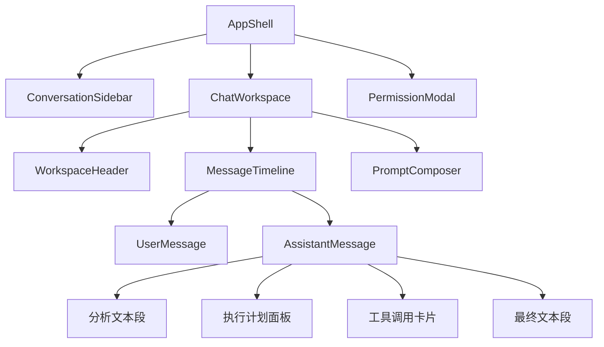

# DeepAgents ACP Demo MVP UI 设计说明书

| 项目 | 内容 |
| --- | --- |
| 适用端 | 桌面浏览器优先，兼容平板与移动浏览器 |
| 技术栈 | Vue 3、TypeScript、Naive UI |
| 视觉依据 | `docs/imgs/home1.png`、`docs/imgs/home2.png`、`docs/imgs/Designer.png`、`docs/imgs/tool_call.png` |
| 核心原则 | 聊天主线按流式顺序交错呈现 AI 分析文本、执行计划面板与单个工具调用卡片：分析在前、工具调用紧随其后、最终回答收尾。过程信息不再整体收纳进单一折叠区。 |

> 实现状态：本文反映当前 `web/src` 已实现行为。消息编辑、删除和服务端消息库为后续范围；当前会话展示状态保存在浏览器 localStorage，Agent checkpoint 由 SQLite 管理。

## 1. 设计目标

界面服务于任务型 Agent 对话：用户快速发起任务、跟随 Agent 的分步分析与工具执行、阅读最终结果。分析文本与工具调用按流式顺序进入聊天流（分析在前、工具卡片紧随其后、最终回答收尾），让用户能看清每一步“为什么这样做、执行了什么”。

设计采用参考图中的工作台式布局：左侧承载会话导航与创建动作，中央承载当前对话与输入动作；组件使用克制的圆角、细边框、柔和层次和明确的交互状态，保持工具型应用的连续工作感。

## 2. 信息架构



### 2.1 页面区域

| 区域 | 内容 | 行为 |
| --- | --- | --- |
| 左侧会话栏 | 品牌、创建会话、会话搜索、会话列表、底部设置入口 | 搜索框按标题关键字过滤会话；选择会话后加载其消息与执行记录；删除会话需二次确认；右键会话项弹出重命名菜单（模态框内编辑标题并保存）；新建会话复用现有空会话，始终保持至多一个空会话；品牌行右侧提供收缩按钮，可收起侧边栏（收起后顶部栏出现展开按钮）。 |
| 顶部工作区栏 | 当前会话标题、连接状态、更多操作 | 保持紧凑，不占用聊天区域；状态以图标和短标签显示；侧边栏收起时显示展开按钮。 |
| 对话主区 | 欢迎态或消息时间线 | 显示用户消息与 AI 消息；AI 消息由分析文本段、执行计划面板、工具调用卡片和最终文本段按流式顺序组成。 |
| 底部输入区 | 大圆角输入卡片、功能按钮栏（附件/技能/工具）、上下文用量、发送、取消 | 固定在工作区底部；输入卡片大圆角样式，输入框上方展示待发送附件；底部栏左侧为附件、技能、工具按钮（点击技能/工具打开右侧功能面板），右侧发送按钮左侧显示当前会话上下文用量（百分比，取整到 1%），悬停可查看具体 `使用量/CONTENT_SIZE`（tokens，总量由 .env 的 CONTENT_SIZE 配置、后端 /api/config 下发）；支持多文件选择、拖拽与剪贴板图片直接粘贴；任务运行时输入框仍可编辑，仅显示取消按钮。 |
| 右侧功能面板 | 标题、关闭图标、功能内容区 | 作为聊天窗口内嵌的第三列静态右侧边栏（宽 300px），默认隐藏（display:none），不显示时不占空间；点击输入区“技能”“工具”按钮（或顶部更多操作中的设置入口）时显示，面板标题与内容根据触发的功能确定（技能面板 / 工具面板 / 设置面板），打开时挤压中间对话区（非浮层、无遮罩），与左侧会话栏形成三列布局；面板右上角带关闭图标，内容区当前为占位说明，后续扩展。 |
| 权限层 | 工具权限说明与审批操作 | 使用模态框阻断当前任务的继续执行，不作为聊天消息插入。 |

## 3. 整体布局

### 3.1 桌面端

整体采用满高双栏布局，浏览器最小推荐宽度为 `1180px`。

```text
+--------------------+----------------------------------------------------------+
| 侧边栏 264px        | 顶部栏 64px                                               |
| 品牌与新建会话      +----------------------------------------------------------+
| 搜索 / 会话列表     |                                                          |
|                     | 对话滚动区，内容最大宽度 840px，居中对齐                 |
|                     | 用户消息                                                  |
|                     | AI 分析文本段 → 执行计划面板 → 工具调用卡片 → 最终回答      |
|                     |                                                          |
| 底部辅助入口        +----------------------------------------------------------+
|                     | 附件按钮 + 自适应输入框 + 发送 / 取消                    |
+--------------------+----------------------------------------------------------+
```

- 页面根节点使用原生 flex 布局，高度为 `100dvh`，禁止页面整体滚动。
- 侧栏固定宽度 `264px`，边界使用 `1px` 细分隔线。
- 中央工作区使用纵向 flex：顶部栏固定 `64px`，输入区按内容高度自适应，消息区占用剩余空间并独立滚动。
- 消息列最大宽度 `840px`，左右留白最小 `32px`；当工作区较窄时允许占满可用宽度。
- 欢迎态居中于消息区可视区域，上半部展示标题与一句任务提示，下半部保留输入区；不使用营销式大卡片。

### 3.2 窄屏与移动端

当视口宽度小于 `900px` 时，侧栏改为 `NDrawer`：顶部栏左侧显示菜单图标，当前会话标题保持可见。消息区水平内边距降为 `16px`，输入区保持底部固定。过程折叠项和工具详情使用单列布局，代码与 JSON 内容允许横向滚动，不挤压正文。

## 4. 组件详细设计

### 4.1 应用壳与会话栏

| 组件 | Naive UI 建议 | 内容与样式 | 交互 |
| --- | --- | --- | --- |
| `AppShell` | 原生 flex 容器、`NDrawer` | 全屏应用骨架，工作区使用浅色画布。 | 响应断点切换固定侧栏与抽屉。 |
| `BrandBlock` | 原生容器、`NIcon` | 24px 标识、产品名和小号环境标签。 | 点击返回当前会话顶部。 |
| `NewConversationButton` | `NButton` | 全宽主按钮，图标在左，文字为“新建会话”。 | 重置当前会话并聚焦输入框。 |
| `ConversationSearch` | `NInput` | 会话栏内小号搜索框，带搜索图标与清除按钮。 | 按标题关键字实时过滤会话列表；无匹配时显示空态提示；新建会话时清空。 |
| `ConversationList` | `NMenu` 或虚拟列表 | 会话标题单行省略，副文本显示完整时间（`YYYY/MM/DD hh:mm:ss`）；选中项使用低饱和蓝色底。 | 单击加载会话；删除按钮仅在悬停时显示，点击弹出 `NPopconfirm` 二次确认（确认按钮为错误色）后才删除。 |
| `WorkspaceHeader` | 原生容器、`NTag`、`NDropdown` | 左侧标题，右侧连接状态点与更多按钮。 | 更多菜单包含重命名、清空显示、删除会话。 |

会话列表不展示 Agent 的中间事件。标题优先采用用户第一条任务的前 24 个字符，加载历史时以服务端 `sessionId` 为唯一标识。

### 4.2 消息时间线

| 组件 | Naive UI 建议 | 显示规则 |
| --- | --- | --- |
| `MessageTimeline` | 原生滚动容器、`NEmpty`、`NSkeleton` | 仅渲染 `user` 与 `assistant` 两类消息；AI 消息内部按 `segments` 交错渲染各段；任务执行期间保留底部运行状态。 |
| `UserMessage` | 原生容器、`NAvatar` | 右对齐，浅蓝背景，最大宽度 `72%`；附件以小型文件胶囊附在正文下方，图片显示缩略预览。 |
| `AssistantMessage` | 原生容器、`NAvatar`、`MarkdownMessage`、`ExecutionProcess`、`ToolCallCard` | 左对齐；按 `segments` 顺序渲染分析文本段、执行计划面板、工具调用卡片与最终文本段，正文支持 Markdown、代码高亮、代码复制和 Mermaid 预览/源码切换。 |
| `AssistantPending` | `NSpin` | 仅在 `pending`、`streaming` 或 `waiting_permission` 状态显示；取消后必须移除加载指示。 |
| `TaskError` | `NAlert` | 作为当前任务的状态块显示于输入区上方，可重试或关闭；不伪装为 AI 回答。 |

消息时间线遵循以下规则：

1. 用户提交后立即插入一条 `UserMessage`。
2. 收到 `agent_thought_chunk` 时追加一条分析文本段；连续分片合并到同一段，若被工具事件隔断则另起一段。
3. 收到 `plan` 时更新执行计划数据，并插入或保持唯一的执行计划面板段。
4. 收到 `tool_call` / `tool_call_start` / `tool_call_update` 时，在工具调用列表注册/更新条目，并为每个工具调用插入或保持独立的工具调用卡片段，按流式顺序位于触发它的分析文本之后。
5. 收到 `agent_message_chunk` 时写入最终文本段，页面显示其流式生成文本，连续分片合并。
6. `session/prompt` 返回完成后固化最终回答；若无文本，显示简短完成状态而不制造空消息。
7. 取消、错误或权限等待显示为任务状态，不计入“用户与 AI 的聊天消息”。

每条用户消息提供复制文本、编辑与“更多操作”菜单（含删除该消息）。已完成的 AI 消息提供复制纯文本、复制 Markdown、编辑与“更多操作”菜单（含删除该消息），其中“重新生成”仅显示在最后一条 AI 消息的操作区（其余 AI 消息隐藏）；编辑以 Markdown 文本编辑并实时预览，仅修改消息文本、不触发重新执行（AI 消息同步 `finalText` 与对应文本分段），流式执行中的消息禁用编辑；删除后该消息及其执行记录从当前会话移除。重新生成复用紧邻用户消息的文本和附件，并原位替换该 AI 消息的执行过程与最终内容。纯文本复制通过 Markdown 解析结果生成，Markdown 复制保留原始文本。

滚动行为：AI 流式输出期间，内容更新后自动滚动到底部（`nextTick(scrollToBottom)`），保持输出过程跟随最新内容。Mermaid 图采用直接渲染：流式期间代码块就绪即异步渲染，并以源代码为 key 缓存渲染结果（mermaidCache），DOM 重建时秒级复用，不随流式更新反复重渲染；mermaid 模块预加载并仅初始化一次。

### 4.3 执行计划面板与工具调用卡片

分析文本与工具调用不再收纳进整体折叠区，而是作为独立消息段按流式顺序进入聊天流；执行计划保留为可折叠面板。

| 段类型 | Naive UI 建议 | 默认状态 | 内容 |
| --- | --- | --- | --- |
| 分析文本段 | `MarkdownMessage` | 始终可见 | 模型的思考/分析文本（`agent_thought_chunk`），按流式顺序显示在触发它的工具调用之前。 |
| 执行计划面板 `ExecutionProcess` | `NCollapse` | 折叠 | 触发文字为“查看执行过程”，同时显示步骤数与耗时；展开后展示任务计划项及 `pending`、`in_progress`、`completed` 状态。 |
| 工具调用卡片 `ToolCallCard` | `NCollapse`、`NTag` | 折叠 | 以图标、工具名、状态标签组成紧凑标题行；展开后分为“参数”与“返回值”两个标签页。 |
| 工具参数 | `MarkdownMessage` | 卡片展开后可见 | 始终为 JSON 字符串，以 `` ```json `` 代码块 + markdown 渲染，带语法高亮与复制按钮。 |
| 工具返回值 | `MarkdownMessage` | 卡片展开后可见 | 输出可能携带 markdown（如 execute 的 Command/Output/Status 结构），直接以 markdown 渲染；非字符串对象回退为 `` ```json `` 代码块。 |

工具调用卡片默认折叠，避免抢占阅读注意力；用户点击某一卡片即可查看其完整参数与返回值。工具调用视觉参考 `tool_call.png`：标题行由图标、工具名和状态标签组成，详情区域采用等宽字体与弱对比底色；卡片内边距 12px/16px，标题与 tab 栏不占满整宽。

工具状态使用统一语义：`running` 为蓝色，`completed` 为绿色，`failed` 为红色，`cancelled` 为灰色，`waiting_permission` 为琥珀色。所有状态均同时提供文字，不能只依赖颜色。

### 4.4 输入与权限组件

| 组件 | Naive UI 建议 | 设计说明 |
| --- | --- | --- |
| `PromptComposer` | `NInput`、`NButton`、`NTooltip` | 多行输入，最小两行、最大六行；Enter 发送，Shift+Enter 换行；任务运行时仍可编辑。 |
| `AttachmentPicker` | 原生文件输入、`NButton` | 支持多选和拖拽。图片显示缩略图并作为 Base64 图像块发送；其他文件上传后以虚拟路径引用。 |
| `SendButton` | `NButton`、`NIcon` | 有效输入或附件时启用，使用发送图标；处理中由唯一的取消图标替代，不与发送图标并列。 |
| `PermissionModal` | `NModal`、`NCard`、`NDescriptions` | 展示工具名称、操作摘要和参数；提供拒绝、允许、始终允许。 |

权限弹窗中，“始终允许”使用次级危险提醒样式，并明确说明其作用范围。用户作出选择前保留当前任务的等待状态；选择结果以一条简短状态记录进入执行过程，不进入主聊天流。

## 5. 色彩、排版与样式

视觉采用参考图的轻量工作台质感：暖白画布、蓝色操作强调、低对比度面板与清晰的深色文本。颜色以令牌实现，供 Naive UI 的 `themeOverrides` 和页面 CSS 共同使用。

| 令牌 | 色值 | 用途 |
| --- | --- | --- |
| `--ui-canvas` | `#F7F8FA` | 工作区与页面背景。 |
| `--ui-surface` | `#FFFFFF` | 侧栏、输入框、弹窗和展开详情底。 |
| `--ui-surface-muted` | `#F1F4F8` | 悬停项、过程摘要与代码块背景。 |
| `--ui-border` | `#E4E8EE` | 分隔线、输入框与列表边框。 |
| `--ui-text` | `#1D2733` | 主标题与正文。 |
| `--ui-text-muted` | `#6B7785` | 辅助说明、时间与未选中图标。 |
| `--ui-primary` | `#2563EB` | 主操作、链接、运行状态与焦点描边。 |
| `--ui-primary-soft` | `#EAF1FF` | 用户消息底、选中会话与轻提示。 |
| `--ui-success` | `#16805B` | 成功状态。 |
| `--ui-warning` | `#B76A00` | 权限等待与警告状态。 |
| `--ui-error` | `#C73737` | 失败与拒绝状态。 |

- 字体：中文使用 `"Microsoft YaHei", "PingFang SC", sans-serif`；代码使用 `"Cascadia Code", Consolas, monospace`。
- 正文为 `14px`、行高 `1.7`；聊天正文可提升至 `15px`；页面标题为 `20px`，不使用大幅标题。
- 基础间距以 `4px` 为单位：页面内边距 `24px`，消息间距 `20px`，组件内部间距 `12px`。
- 圆角：输入框、消息与面板使用 `8px`；图标按钮使用 `6px`；不使用过度圆润的胶囊卡片。
- 阴影：仅弹窗和浮层使用 `0 8px 24px rgba(29, 39, 51, 0.12)`；常规分区依靠边框与背景区分。

## 6. 状态与数据映射设计

### 6.1 前端视图模型

```ts
type ChatMessage = UserMessage | AssistantMessage

interface UserMessage {
	id: string
	role: 'user'
	text: string
	attachments: AttachmentRef[]
	createdAt: number
}

type AssistantSegment =
	| { id: string; type: 'text'; text: string }       // 最终文本段（连续分片合并）
	| { id: string; type: 'thought'; text: string }    // 分析文本段（连续分片合并）
	| { id: string; type: 'plan' }                     // 执行计划面板段
	| { id: string; type: 'tool'; toolId: string }     // 工具调用卡片段，引用 toolCalls 条目

interface AssistantMessage {
	id: string
	role: 'assistant'
	finalText: string
	status: 'pending' | 'streaming' | 'completed' | 'cancelled' | 'failed'
	process: ExecutionProcess
	segments: AssistantSegment[]
	createdAt: number
}

interface ExecutionProcess {
	startedAt: number
	completedAt?: number
	plan: PlanEntry[]
	analyses: AnalysisEntry[]   // 仅用于旧数据迁移，新数据不再写入
	toolCalls: ToolCallEntry[]
}

interface ToolCallEntry {
	id: string
	name: string
	title?: string
	status: ProcessStatus
	rawInput?: unknown
	output?: unknown
}
```

`messages` 只保存 `UserMessage` 和 `AssistantMessage`。AI 消息的展示顺序由 `segments` 按流式事件到达顺序决定：分析文本、执行计划、工具调用卡片与最终文本交错排列；工具详情（参数/返回值）挂在 `process.toolCalls` 条目上，由卡片段按 `toolId` 引用。旧版本地数据在加载时自动迁移为新的分段结构（计划 → 分析 → 工具 → 最终文本）。

### 6.2 ACP 事件映射

| ACP 事件 | 前端状态更新 | 页面呈现 |
| --- | --- | --- |
| `initialize` | 设置 Agent 能力与连接状态 | 顶部栏连接状态。 |
| `session/new` | 创建当前会话 ID | 新会话进入可输入状态。 |
| `session/load` | 载入会话并重建消息、分段与工具记录 | 展示历史用户消息与 AI 分段；工具卡片默认折叠。 |
| `agent_thought_chunk` | 追加分析文本段（连续分片合并） | 分析文本作为可见消息段，位于后续工具调用之前。 |
| `plan` | 替换或更新 `process.plan`，插入计划面板段 | 唯一的“查看执行过程”折叠面板显示计划项。 |
| `tool_call` / `tool_call_start` | 新建工具条目并插入工具卡片段 | 独立折叠卡片，按流式顺序位于触发它的分析文本之后。 |
| `tool_call_update` | 更新参数、返回值与状态 | 对应卡片的状态标签与参数/返回值内容更新。 |
| `agent_message_chunk` | 追加到 `finalText` 与最终文本段 | 最终文本段流式更新。 |
| `session/request_permission` | 当前任务状态改为 `waiting_permission` | 打开权限弹窗。 |
| `session/prompt` 成功响应 | 任务状态置为 `completed` | 固化最终回答；若为空则显示“任务已完成”。 |
| `session/cancel` 或异常 | 任务状态置为 `cancelled` 或 `failed` | 显示状态提示并保留已收集分段；取消时所有未完成工具状态同步改为 `cancelled`。 |

### 6.3 滚动与阅读位置

- 用户提交任务后，将新用户消息和 `AssistantPending` 滚动至可视区域。
- 用户停留在消息底部附近时，AI 最终回答流式更新自动跟随到底部。
- 用户主动向上阅读历史后，停止自动滚动，显示“回到底部”图标按钮。
- 展开执行计划或工具卡片不改变全局自动滚动策略；只在当前项底部超出可视区域时做最小量滚动。

## 7. 交互与可访问性规范

- 所有图标按钮使用 `NTooltip` 或 `aria-label` 提供名称，例如“新建会话”“上传附件”“取消任务”“回到底部”。
- 键盘顺序依次经过侧栏、头部操作、消息内容和输入区；展开器可通过 Enter 或 Space 操作。
- 状态颜色必须配合文本与图标；工具调用结果与权限状态不能仅靠颜色区分。
- Markdown 表格、长链接、JSON 和工具返回值不得撑破消息列，内容区应换行或横向滚动。
- `NModal` 打开时焦点锁定在弹窗中，拒绝和关闭操作始终可达。
- 流式回答使用 `aria-live="polite"`，避免每个分片都造成高频播报；执行过程更新不使用强制播报。
- 语言在中文、日文和英文之间切换，首次使用时遵循浏览器语言，后续选择保存到 `acp-ui-locale`。

## 8. 组件实现边界

当前 `web/src` 按以下组件拆分，协议解析集中在 `ChatPage.vue` 的组合式逻辑中，展示组件不直接处理 WebSocket：

```text
src/
	pages/ChatPage.vue
	components/ConversationSidebar.vue
	components/WorkspaceHeader.vue
	components/MessageTimeline.vue
	components/MarkdownMessage.vue
	components/ExecutionProcess.vue
	components/ToolCallCard.vue
	components/PromptComposer.vue
	components/PermissionModal.vue
```

- `ChatPage.vue` 负责 WebSocket、JSON-RPC 请求关联、ACP 事件归一化、分段（segments）构建与旧数据迁移。
- `ExecutionProcess.vue` 仅接收标准化执行计划数据，渲染“查看执行过程”折叠面板，不感知 ACP 报文细节。
- `ToolCallCard.vue` 渲染单个工具调用折叠卡片：参数 tab 以 `` ```json `` 代码块 + markdown 渲染，返回值 tab 以 markdown 渲染（非字符串回退 json 代码块），并显示统一状态标签。
- `MarkdownMessage.vue` 提供 markdown 渲染管线（含语法高亮与复制按钮），供文本/分析段、参数和返回值共用。
- 页面主题通过 `NConfigProvider` 的 `themeOverrides` 注入，并使用第 5 节令牌统一扩展页面 CSS。

## 9. 验收标准

| 编号 | 验收项 | 通过标准 |
| --- | --- | --- |
| UI-01 | 主布局 | 桌面端显示固定会话栏、顶部工作区栏、独立滚动消息区和底部输入区；窄屏端侧栏切换为抽屉。 |
| UI-02 | 交错渲染 | 分析文本与工具调用按流式顺序交错进入聊天流：分析在前、对应工具卡片紧随其后、最终回答收尾；每条工具调用是独立可折叠卡片。 |
| UI-03 | 最终回答 | Agent 流式文本在同一条 AI 消息的最终文本段中更新，任务完成后形成一条完整最终回答。 |
| UI-04 | 执行计划 | AI 消息中存在默认折叠的“查看执行过程”面板；展开后展示任务计划项与状态。 |
| UI-05 | 工具详情 | 每个工具调用可查看名称、状态、参数和返回值；参数 tab 始终为 `` ```json `` 代码块（语法高亮、可复制），返回值 tab 以 markdown 渲染（非字符串回退 json 代码块）。 |
| UI-06 | 权限流程 | 权限请求以模态框呈现，支持拒绝、允许和始终允许，结果同步写入工具状态。 |
| UI-07 | 视觉一致性 | 页面使用定义的颜色令牌、统一卡片内边距（header 12px/16px、内容区 16px/14px、tab 5px/12px/7px）、明确焦点态和一致的状态语义色。 |
| UI-08 | 会话搜索 | 会话栏搜索框按标题关键字实时过滤；无匹配时显示空态提示；新建会话后搜索词清空。 |
| UI-09 | 会话删除确认 | 删除按钮悬停显示，点击弹出二次确认（`NPopconfirm`，确认按钮为错误色）；确认后会话被移除，取消则保留。 |
| UI-10 | 时间格式 | 会话列表与消息元信息时间统一显示为 `YYYY/MM/DD hh:mm:ss`（24 小时制）。 |
| UI-11 | 复制反馈 | 复制文本、复制 Markdown 与代码块复制成功后均显示“已复制”提示消息。 |
| UI-12 | 会话有效性 | 页面加载后以后端 checkpoint 为准校验历史会话；失效会话（如 `db` 被删除）自动清理，全部失效时自动新建空会话。 |
| UI-13 | 智能滚动 | AI 输出期间内容更新后自动滚动到底部，跟随最新输出；提交任务后新消息滚动至可视区域。 |
| UI-14 | Mermaid 渲染 | 流式期间代码块就绪即异步渲染，按源码缓存结果复用，不随流式更新反复重渲染；mermaid 模块预加载，渲染过程不阻塞流式文本。 |
| UI-15 | 消息操作菜单 | 用户与 AI 消息均提供“更多操作”下拉菜单，包含“删除该消息”；删除后消息与执行记录即时从会话移除并持久化。 |
| UI-16 | 消息编辑 | 用户与 AI 历史消息均可编辑，编辑按钮位于“更多操作”之前；以 Markdown 文本编辑并实时预览，保存后同步消息文本（AI 消息同步 `finalText` 与文本分段），仅编辑文本不触发重新执行；流式执行中的消息禁用编辑。 |
| UI-17 | 图片粘贴 | 输入框获得焦点时可直接粘贴剪贴板图片（截图无需保存为文件），作为图片附件加入待发送列表并显示预览。 |
| UI-18 | 会话重命名 | 右键会话列表项弹出重命名菜单（与消息菜单风格一致），模态框内编辑新标题，保存后即时更新并持久化。 |
| UI-19 | 空会话策略 | 新建会话时若已存在空会话则直接复用，不再产生第二个空会话；历史遗留的多余默认空会话在页面加载时清理，仅保留一个。 |
| UI-20 | 输入框样式与上下文 | 输入框为大圆角卡片；底部功能栏含附件、技能、工具按钮（技能/工具打开右侧功能面板）；发送按钮左侧显示当前会话上下文用量百分比（已使用/CONTENT_SIZE，取整），悬停显示具体 `使用量/CONTENT_SIZE`（tokens，总量来自 .env 的 CONTENT_SIZE，经后端 /api/config 下发）。 |
| UI-21 | 侧边栏收缩 | 左侧会话栏品牌行右侧提供收缩按钮，点击收起侧边栏；收起后顶部栏左侧出现展开按钮，点击恢复；移动端仍使用抽屉导航。 |
| UI-22 | 右侧功能面板 | 整体为三列布局，右侧功能面板是聊天窗口内嵌的静态右栏（300px），默认隐藏、不占空间；点击输入区“技能”或“工具”按钮显示，面板标题与内容根据触发功能确定（技能/工具/设置面板），无标签页切换；右上角带关闭图标，打开时挤压中间对话区（无遮罩浮层效果）；内容区当前为占位说明，后续扩展。 |
| UI-23 | 滚动到底部按钮 | 对话区右下角提供圆形“滚动到底部”按钮，仅在滚动条未到达底部时显示；点击平滑滚动至最底部，到达底部后自动隐藏；流式输出时的自动跟随滚动采用瞬时定位（跳过 smooth 动画，避免与内容增量叠加造成抖动）。 |
| UI-24 | 附件预览与下载 | 消息中发送的附件 chip 可点击：图片附件在新窗口打开预览，普通文件附件触发浏览器下载（保留原文件名）。 |
| UI-17 | 字体适配 | 界面字体随语言切换：中文使用苹方/微软雅黑栈，日语使用 Hiragino/游哥特/Meiryo 栈，英语使用 Inter/Segoe UI 栈；naive-ui 组件与页面正文同步生效。 |
