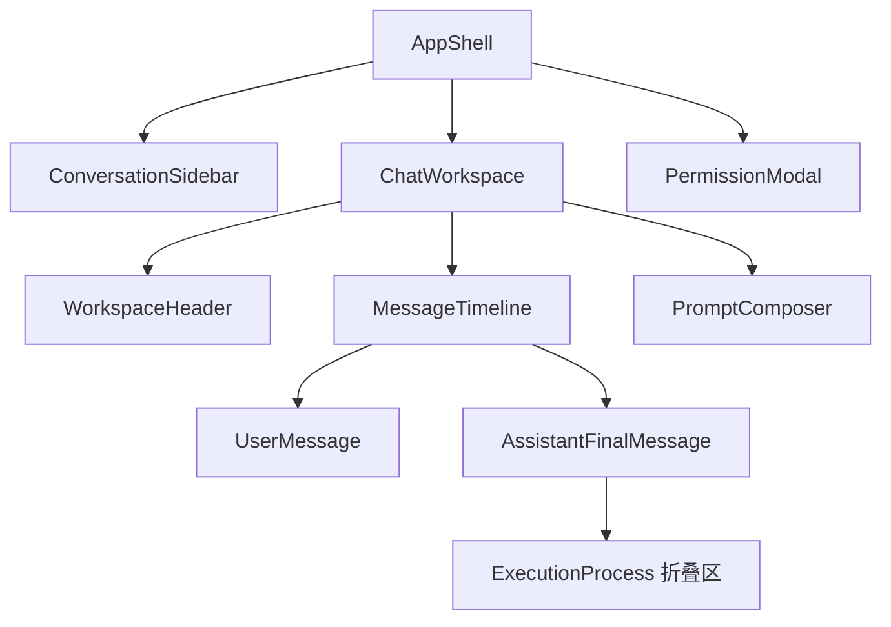

# DeepAgents ACP Demo MVP UI 设计说明书

| 项目 | 内容 |
| --- | --- |
| 适用端 | 桌面浏览器优先，兼容平板与移动浏览器 |
| 技术栈 | Vue 3、TypeScript、Naive UI |
| 视觉依据 | `docs/imgs/home1.png`、`docs/imgs/home2.png`、`docs/imgs/Designer.png`、`docs/imgs/tool_call.png` |
| 核心原则 | 聊天主线只呈现用户消息与 AI 最终回答；计划、分析和工具调用统一收纳为可展开的执行过程。 |

> 实现状态：本文反映当前 `web/src` 已实现行为。消息编辑、删除和服务端消息库为后续范围；当前会话展示状态保存在浏览器 localStorage，Agent checkpoint 由 SQLite 管理。

## 1. 设计目标

界面服务于任务型 Agent 对话：用户快速发起任务、确认 Agent 的执行状态、阅读最终结果，并在需要时回溯任务的执行过程。页面不将模型思考分片、计划更新或工具返回直接混入聊天流，避免对话内容被过程信息淹没。

设计采用参考图中的工作台式布局：左侧承载会话导航与创建动作，中央承载当前对话与输入动作；组件使用克制的圆角、细边框、柔和层次和明确的交互状态，保持工具型应用的连续工作感。

## 2. 信息架构



### 2.1 页面区域

| 区域 | 内容 | 行为 |
| --- | --- | --- |
| 左侧会话栏 | 品牌、创建会话、会话列表、底部设置入口 | 选择会话后加载其消息与执行记录；新建会话清空当前工作区。 |
| 顶部工作区栏 | 当前会话标题、连接状态、更多操作 | 保持紧凑，不占用聊天区域；状态以图标和短标签显示。 |
| 对话主区 | 欢迎态或消息时间线 | 仅显示用户消息、AI 最终回答和非侵入式运行状态。 |
| 底部输入区 | 附件、文本输入、发送、取消 | 固定在工作区底部；支持多文件选择与拖拽；任务运行时输入框仍可编辑，仅显示取消按钮。 |
| 权限层 | 工具权限说明与审批操作 | 使用模态框阻断当前任务的继续执行，不作为聊天消息插入。 |

## 3. 整体布局

### 3.1 桌面端

整体采用满高双栏布局，浏览器最小推荐宽度为 `1180px`。

```text
+--------------------+----------------------------------------------------------+
| 侧边栏 264px        | 顶部栏 64px                                               |
| 品牌与新建会话      +----------------------------------------------------------+
| 搜索 / 会话列表     |                                                          |
|                     | 对话滚动区，内容最大宽度 840px，居中对齐                 |
|                     | 用户消息                                                  |
|                     | AI 最终回答 + 可折叠执行过程                              |
|                     |                                                          |
| 底部辅助入口        +----------------------------------------------------------+
|                     | 附件按钮 + 自适应输入框 + 发送 / 取消                    |
+--------------------+----------------------------------------------------------+
```

- 页面根节点使用原生 flex 布局，高度为 `100dvh`，禁止页面整体滚动。
- 侧栏固定宽度 `264px`，边界使用 `1px` 细分隔线。
- 中央工作区使用纵向 flex：顶部栏固定 `64px`，输入区按内容高度自适应，消息区占用剩余空间并独立滚动。
- 消息列最大宽度 `840px`，左右留白最小 `32px`；当工作区较窄时允许占满可用宽度。
- 欢迎态居中于消息区可视区域，上半部展示标题与一句任务提示，下半部保留输入区；不使用营销式大卡片。

### 3.2 窄屏与移动端

当视口宽度小于 `900px` 时，侧栏改为 `NDrawer`：顶部栏左侧显示菜单图标，当前会话标题保持可见。消息区水平内边距降为 `16px`，输入区保持底部固定。过程折叠项和工具详情使用单列布局，代码与 JSON 内容允许横向滚动，不挤压正文。

## 4. 组件详细设计

### 4.1 应用壳与会话栏

| 组件 | Naive UI 建议 | 内容与样式 | 交互 |
| --- | --- | --- | --- |
| `AppShell` | 原生 flex 容器、`NDrawer` | 全屏应用骨架，工作区使用浅色画布。 | 响应断点切换固定侧栏与抽屉。 |
| `BrandBlock` | 原生容器、`NIcon` | 24px 标识、产品名和小号环境标签。 | 点击返回当前会话顶部。 |
| `NewConversationButton` | `NButton` | 全宽主按钮，图标在左，文字为“新建会话”。 | 重置当前会话并聚焦输入框。 |
| `ConversationList` | `NMenu` 或虚拟列表 | 会话标题单行省略，副文本显示最近时间；选中项使用低饱和蓝色底。 | 单击加载会话，右键或更多按钮显示重命名与删除菜单。 |
| `WorkspaceHeader` | 原生容器、`NTag`、`NDropdown` | 左侧标题，右侧连接状态点与更多按钮。 | 更多菜单包含重命名、清空显示、删除会话。 |

会话列表不展示 Agent 的中间事件。标题优先采用用户第一条任务的前 24 个字符，加载历史时以服务端 `sessionId` 为唯一标识。

### 4.2 消息时间线

| 组件 | Naive UI 建议 | 显示规则 |
| --- | --- | --- |
| `MessageTimeline` | 原生滚动容器、`NEmpty`、`NSkeleton` | 仅渲染 `user` 与 `assistant-final` 两类消息；任务执行期间保留底部运行状态。 |
| `UserMessage` | 原生容器、`NAvatar` | 右对齐，浅蓝背景，最大宽度 `72%`；附件以小型文件胶囊附在正文下方，图片显示缩略预览。 |
| `AssistantFinalMessage` | 原生容器、`NAvatar`、`MarkdownMessage` | 左对齐，正文支持 Markdown、代码高亮、代码复制和 Mermaid 预览/源码切换。 |
| `AssistantPending` | `NSpin` | 仅在 `pending`、`streaming` 或 `waiting_permission` 状态显示；取消后必须移除加载指示。 |
| `TaskError` | `NAlert` | 作为当前任务的状态块显示于输入区上方，可重试或关闭；不伪装为 AI 回答。 |

消息时间线遵循以下规则：

1. 用户提交后立即插入一条 `UserMessage`。
2. 收到 `agent_thought_chunk`、`plan` 或工具事件时，不新增聊天消息，仅更新当前任务的执行过程数据。
3. 收到 `agent_message_chunk` 时写入当前任务的最终答复缓冲区；页面可显示其流式生成文本，但始终只占用一条 `AssistantFinalMessage`。
4. `session/prompt` 返回完成后，将缓冲区固化为最终回答；若无文本，显示简短完成状态而不制造空消息。
5. 取消、错误或权限等待显示为任务状态，不计入“用户与 AI 的聊天消息”。

每条用户消息提供复制文本按钮。已完成的 AI 消息提供重新生成、复制纯文本与复制 Markdown 按钮；重新生成复用紧邻用户消息的文本和附件，并原位替换该 AI 消息的执行过程与最终内容。纯文本复制通过 Markdown 解析结果生成，Markdown 复制保留原始文本。

### 4.3 执行过程折叠区

执行过程位于对应 AI 最终回答下方。它不是独立聊天消息，而是 `AssistantFinalMessage` 的从属信息。

| 层级 | Naive UI 建议 | 默认状态 | 内容 |
| --- | --- | --- | --- |
| `ExecutionProcess` | `NCollapse` | 折叠 | 触发文字为“查看执行过程”，同时显示步骤数、耗时和完成状态。 |
| 计划项 | `NSteps` 或轻量列表 | 展开后可见 | 任务标题与 `pending`、`running`、`completed` 状态。 |
| 分析项 | 嵌套 `NCollapseItem` | 折叠 | 仅显示阶段标题、时间和摘要；展开后显示该阶段的分析文本。 |
| 工具调用项 | 嵌套 `NCollapseItem`、`NTag` | 折叠 | 工具名称、执行状态、耗时和结果摘要。 |
| 工具参数 / 返回值 | `NCode`、`NTabs` | 工具项展开后可见 | 分为“参数”和“返回值”两个标签页，使用格式化 JSON 或纯文本。 |

整体过程区默认收起，避免抢占最终回答的阅读注意力。展开整体过程后，每一条分析和工具调用仍保持收起；用户只需点击某一项即可查看其完整参数与返回值。工具调用视觉参考 `tool_call.png`：以图标、工具名、状态标签和一行摘要组成紧凑标题行，详情区域采用等宽字体与弱对比底色。

工具状态使用统一语义：`running` 为蓝色，`completed` 为绿色，`failed` 为红色，`cancelled` 为灰色，`waiting_permission` 为琥珀色。所有状态均同时提供文字，不能只依赖颜色。

### 4.4 输入与权限组件

| 组件 | Naive UI 建议 | 设计说明 |
| --- | --- | --- |
| `PromptComposer` | `NInput`、`NButton`、`NTooltip` | 多行输入，最小两行、最大六行；Enter 发送，Shift+Enter 换行；任务运行时仍可编辑。 |
| `AttachmentPicker` | 原生文件输入、`NButton` | 支持多选和拖拽。图片显示缩略图并作为 Base64 图像块发送；其他文件上传后以虚拟路径引用。 |
| `SendButton` | `NButton`、`NIcon` | 有效输入或附件时启用，使用发送图标；处理中由唯一的取消图标替代，不与发送图标并列。 |
| `PermissionModal` | `NModal`、`NCard`、`NDescriptions` | 展示工具名称、操作摘要和参数；提供拒绝、允许、始终允许。 |

权限弹窗中，“始终允许”使用次级危险提醒样式，并明确说明其作用范围。用户作出选择前保留当前任务的等待状态；选择结果以一条简短状态记录进入执行过程，不进入主聊天流。

## 5. 色彩、排版与样式

视觉采用参考图的轻量工作台质感：暖白画布、蓝色操作强调、低对比度面板与清晰的深色文本。颜色以令牌实现，供 Naive UI 的 `themeOverrides` 和页面 CSS 共同使用。

| 令牌 | 色值 | 用途 |
| --- | --- | --- |
| `--ui-canvas` | `#F7F8FA` | 工作区与页面背景。 |
| `--ui-surface` | `#FFFFFF` | 侧栏、输入框、弹窗和展开详情底。 |
| `--ui-surface-muted` | `#F1F4F8` | 悬停项、过程摘要与代码块背景。 |
| `--ui-border` | `#E4E8EE` | 分隔线、输入框与列表边框。 |
| `--ui-text` | `#1D2733` | 主标题与正文。 |
| `--ui-text-muted` | `#6B7785` | 辅助说明、时间与未选中图标。 |
| `--ui-primary` | `#2563EB` | 主操作、链接、运行状态与焦点描边。 |
| `--ui-primary-soft` | `#EAF1FF` | 用户消息底、选中会话与轻提示。 |
| `--ui-success` | `#16805B` | 成功状态。 |
| `--ui-warning` | `#B76A00` | 权限等待与警告状态。 |
| `--ui-error` | `#C73737` | 失败与拒绝状态。 |

- 字体：中文使用 `"Microsoft YaHei", "PingFang SC", sans-serif`；代码使用 `"Cascadia Code", Consolas, monospace`。
- 正文为 `14px`、行高 `1.7`；聊天正文可提升至 `15px`；页面标题为 `20px`，不使用大幅标题。
- 基础间距以 `4px` 为单位：页面内边距 `24px`，消息间距 `20px`，组件内部间距 `12px`。
- 圆角：输入框、消息与面板使用 `8px`；图标按钮使用 `6px`；不使用过度圆润的胶囊卡片。
- 阴影：仅弹窗和浮层使用 `0 8px 24px rgba(29, 39, 51, 0.12)`；常规分区依靠边框与背景区分。

## 6. 状态与数据映射设计

### 6.1 前端视图模型

```ts
type ChatMessage = UserMessage | AssistantMessage

interface UserMessage {
	id: string
	role: 'user'
	text: string
	attachments: AttachmentRef[]
	createdAt: number
}

interface AssistantMessage {
	id: string
	role: 'assistant'
	finalText: string
	status: 'pending' | 'streaming' | 'completed' | 'cancelled' | 'failed'
	process: ExecutionProcess
	createdAt: number
}

interface ExecutionProcess {
	summary: { stepCount: number; status: ProcessStatus; durationMs?: number }
	plan: PlanEntry[]
	analyses: AnalysisEntry[]
	toolCalls: ToolCallEntry[]
}

interface ToolCallEntry {
	id: string
	name: string
	title?: string
	status: ProcessStatus
	rawInput?: unknown
	output?: unknown
	startedAt?: number
	endedAt?: number
}
```

`messages` 只保存 `UserMessage` 和 `AssistantMessage`；思考分片、计划和工具调用只写入 `AssistantMessage.process`，因此从数据结构上保证中间过程不会作为独立消息显示。

### 6.2 ACP 事件映射

| ACP 事件 | 前端状态更新 | 页面呈现 |
| --- | --- | --- |
| `initialize` | 设置 Agent 能力与连接状态 | 顶部栏连接状态。 |
| `session/new` | 创建当前会话 ID | 新会话进入可输入状态。 |
| `session/load` | 载入会话并重建消息、过程记录 | 展示历史用户/最终回答；过程仍默认折叠。 |
| `agent_thought_chunk` | 追加到 `process.analyses` | 仅在执行过程的分析项中可查看。 |
| `plan` | 替换或更新 `process.plan` | 仅在执行过程展开后显示。 |
| `tool_call` / `tool_call_start` | 新建工具调用条目 | 执行过程摘要增加步骤；工具详情默认折叠。 |
| `tool_call_update` | 更新参数、返回值与状态 | 详情区域更新；主聊天流不新增内容。 |
| `agent_message_chunk` | 追加到 `finalText` | 同一条 AI 回答流式更新。 |
| `session/request_permission` | 当前任务状态改为 `waiting_permission` | 打开权限弹窗。 |
| `session/prompt` 成功响应 | 任务状态置为 `completed` | 固化最终回答，显示“查看执行过程”。 |
| `session/cancel` 或异常 | 任务状态置为 `cancelled` 或 `failed` | 显示状态提示并保留已收集过程；取消时所有未完成工具状态同步改为 `cancelled`。 |

### 6.3 滚动与阅读位置

- 用户提交任务后，将新用户消息和 `AssistantPending` 滚动至可视区域。
- 用户停留在消息底部附近时，AI 最终回答流式更新自动跟随到底部。
- 用户主动向上阅读历史后，停止自动滚动，显示“回到底部”图标按钮。
- 展开执行过程不改变全局自动滚动策略；只在当前项底部超出可视区域时做最小量滚动。

## 7. 交互与可访问性规范

- 所有图标按钮使用 `NTooltip` 或 `aria-label` 提供名称，例如“新建会话”“上传附件”“取消任务”“回到底部”。
- 键盘顺序依次经过侧栏、头部操作、消息内容和输入区；展开器可通过 Enter 或 Space 操作。
- 状态颜色必须配合文本与图标；工具调用结果与权限状态不能仅靠颜色区分。
- Markdown 表格、长链接、JSON 和工具返回值不得撑破消息列，内容区应换行或横向滚动。
- `NModal` 打开时焦点锁定在弹窗中，拒绝和关闭操作始终可达。
- 流式回答使用 `aria-live="polite"`，避免每个分片都造成高频播报；执行过程更新不使用强制播报。
- 语言在中文、日文和英文之间切换，首次使用时遵循浏览器语言，后续选择保存到 `acp-ui-locale`。

## 8. 组件实现边界

建议按以下 Vue 组件拆分，所有协议解析集中在组合式函数，展示组件不直接处理 WebSocket：

```text
src/
	pages/ChatPage.vue
	components/chat/ConversationSidebar.vue
	components/chat/WorkspaceHeader.vue
	components/chat/MessageTimeline.vue
	components/chat/UserMessage.vue
	components/chat/AssistantFinalMessage.vue
	components/chat/ExecutionProcess.vue
	components/chat/ToolCallDetail.vue
	components/chat/PromptComposer.vue
	components/chat/PermissionModal.vue
	composables/useAcpSession.ts
	stores/chat.ts
	types/chat.ts
```

- `useAcpSession.ts` 负责 WebSocket、JSON-RPC 请求关联、ACP 事件归一化和取消逻辑。
- `stores/chat.ts` 负责会话、消息与执行过程的持久化视图状态。
- `ExecutionProcess.vue` 仅接收标准化 `ExecutionProcess` 数据，不感知 ACP 报文细节。
- 页面主题通过 `NConfigProvider` 的 `themeOverrides` 注入，并使用第 5 节令牌统一扩展页面 CSS。

## 9. 验收标准

| 编号 | 验收项 | 通过标准 |
| --- | --- | --- |
| UI-01 | 主布局 | 桌面端显示固定会话栏、顶部工作区栏、独立滚动消息区和底部输入区；窄屏端侧栏切换为抽屉。 |
| UI-02 | 消息主线 | 聊天时间线只显示用户消息和 AI 最终回答；分析、计划和工具事件不作为独立气泡出现。 |
| UI-03 | 最终回答 | Agent 流式文本在同一条 AI 消息中更新，任务完成后形成一条完整最终回答。 |
| UI-04 | 执行过程 | AI 回答下方存在默认折叠的执行过程；整体展开后，分析和每个工具调用仍可独立展开。 |
| UI-05 | 工具详情 | 每个工具调用可查看名称、状态、参数和返回值；参数与返回值以可复制、可滚动的格式化内容展示。 |
| UI-06 | 权限流程 | 权限请求以模态框呈现，支持拒绝、允许和始终允许，结果同步写入执行过程。 |
| UI-07 | 视觉一致性 | 页面使用定义的颜色令牌、8px 及以下圆角、明确焦点态和一致的状态语义色。 |
